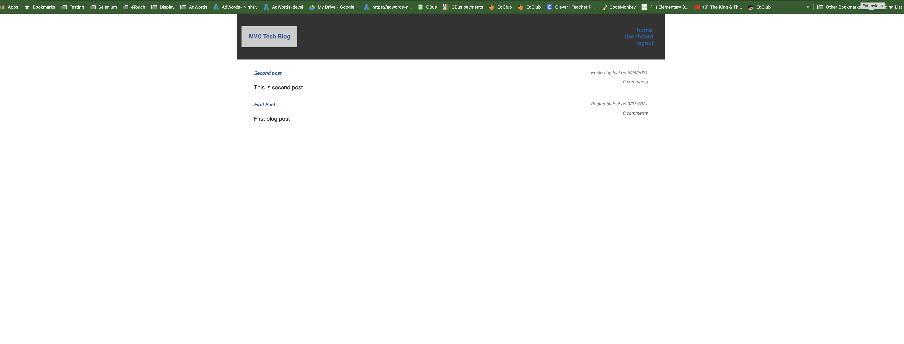
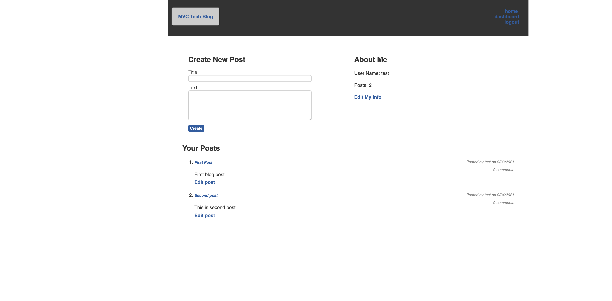

# mvc-tech-blog

## Description:

This is a tech blog that allows a user to post about whatever they wish. It supports account creation with secure password hashing and storage as well as the ability to login. Users can view all posts, or go to their dashboards to see the posts they have made. They can also comment on posts if they are logged in. 

## Built With:

- Node.js
- Express.js
- JavaScript
- Sequelize
- Bcrypt
- MYSQL2
- Handlebars.js
- Heroku with JAWSDB
- dotenv

## Link To Application:

https://anamika-mvc-tech-blog.herokuapp.com/

## Screenshots:

